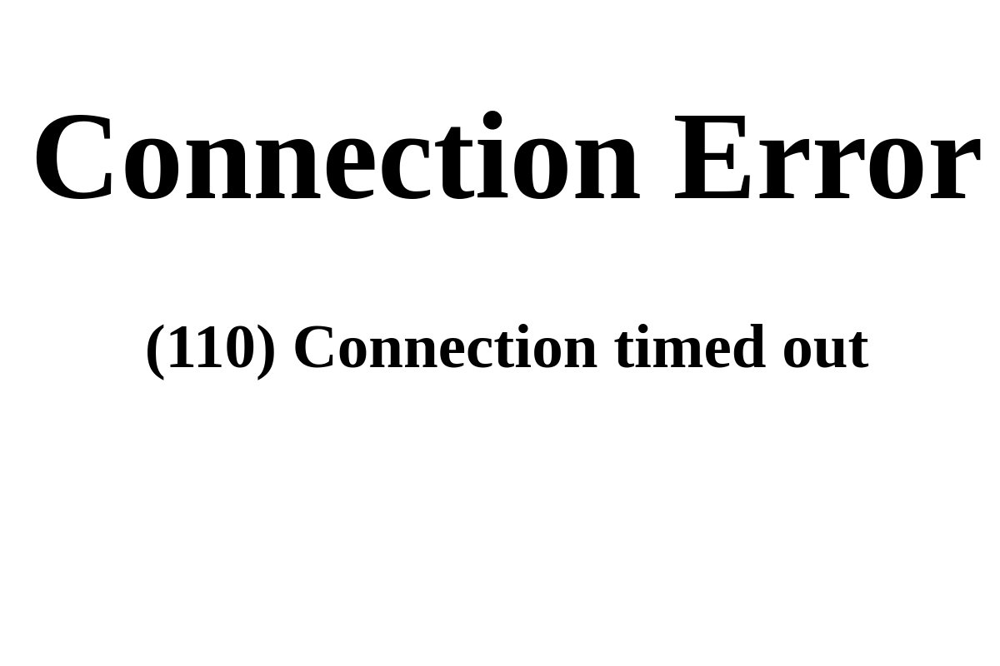

# 🌱 Plant Watering Tracker

A simple web application to track your plants and their watering schedules. Never forget to water your plants again!

## Demo




## Product Context

### End Users

Plant owners (beginners and experienced) who want to maintain a consistent watering schedule for their indoor/outdoor plants.

### Problem

Plant owners often forget when they last watered their plants or struggle to maintain consistent watering schedules, leading to under/over-watering and plant health issues.

### Solution

A simple web app where users can:
- Add plants with custom watering frequencies
- Track when each plant was last watered
- See visual status indicators (overdue, due today, good)
- Mark plants as watered with one click

## Features

### Implemented (Version 2)

- ✅ Add plants with name and watering frequency
- ✅ Automatic watering schedule calculation
- ✅ Visual status indicators (overdue/due today/upcoming)
- ✅ One-click watering confirmation
- ✅ Delete plants
- ✅ SQLite database persistence
- ✅ Docker support for easy deployment
- ✅ Responsive Bootstrap UI
- ✅ RESTful API

### Not Yet Implemented

- ⬜ Plant categories/tags
- ⬜ Notifications/reminders
- ⬜ Photo uploads for plants
- ⬜ Multiple user accounts
- ⬜ Export/import data

## Usage

### Running Locally (without Docker)

1. Ensure Python 3.11+ is installed
2. Install dependencies:
   ```bash
   pip install -r requirements.txt
   ```
3. Start the server:
   ```bash
   uvicorn app:app --host 0.0.0.0 --port 8000
   ```
4. Open browser and navigate to: `http://localhost:8000`

### Using the Application

1. **Add a Plant**: Fill in the plant name and watering frequency (in days), then click "Add"
2. **View Status**: Each plant card shows:
   - 🔴 **Red border**: Overdue for watering
   - 🟡 **Yellow border**: Due today
   - 🟢 **Green border**: Good, next watering in X days
3. **Water a Plant**: Click the "Water" button to mark it as watered
4. **Delete a Plant**: Click the trash icon to remove a plant

## Deployment

### Requirements

- **OS**: Ubuntu 24.04 (or any Linux with Docker support)
- **Required Software**:
  - Docker
  - Docker Compose

### Step-by-Step Deployment

1. **Clone the repository**:
   ```bash
   git clone <your-repo-url>
   cd se-toolkit-hackathon
   ```

2. **Build and start with Docker Compose**:
   ```bash
   docker compose up -d --build
   ```

3. **Access the application**:
   Open browser and navigate to: `http://<your-server-ip>:8000`

### Manual Deployment (without Docker)

1. Install Python 3.11+:
   ```bash
   sudo apt update
   sudo apt install python3.11 python3-pip
   ```

2. Install dependencies:
   ```bash
   pip3 install -r requirements.txt
   ```

3. Run with uvicorn:
   ```bash
   uvicorn app:app --host 0.0.0.0 --port 8000
   ```

4. (Optional) Run as a systemd service for production

## Project Structure

```
se-toolkit-hackathon/
├── app.py              # FastAPI backend
├── requirements.txt    # Python dependencies
├── Dockerfile          # Docker image definition
├── docker-compose.yml  # Docker Compose configuration
├── .dockerignore       # Docker ignore patterns
├── data/               # SQLite database (auto-created)
│   └── plants.db
└── static/             # Frontend files
    ├── index.html
    ├── style.css
    └── app.js
```

## Technology Stack

- **Backend**: Python FastAPI
- **Database**: SQLite
- **Frontend**: HTML5, CSS3, JavaScript (Bootstrap 5)
- **Deployment**: Docker & Docker Compose

## License

MIT License - see LICENSE file for details.
